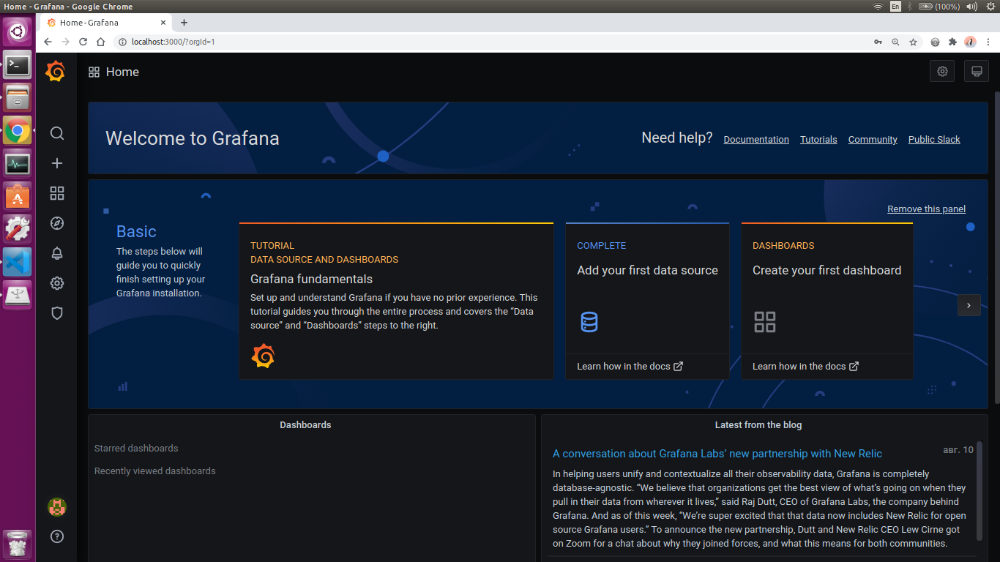
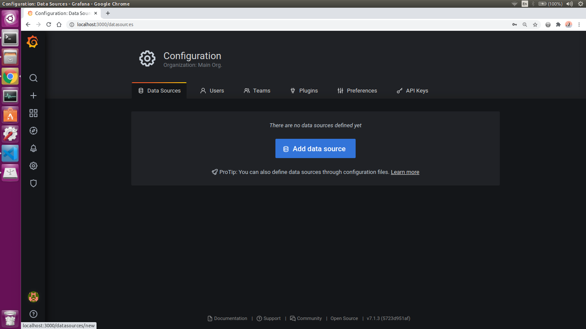
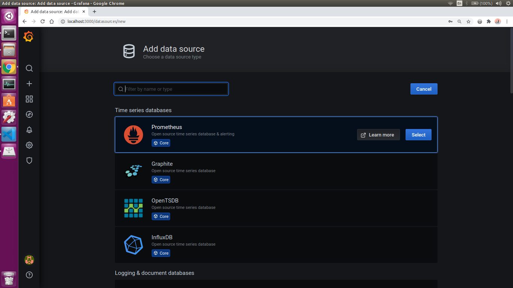
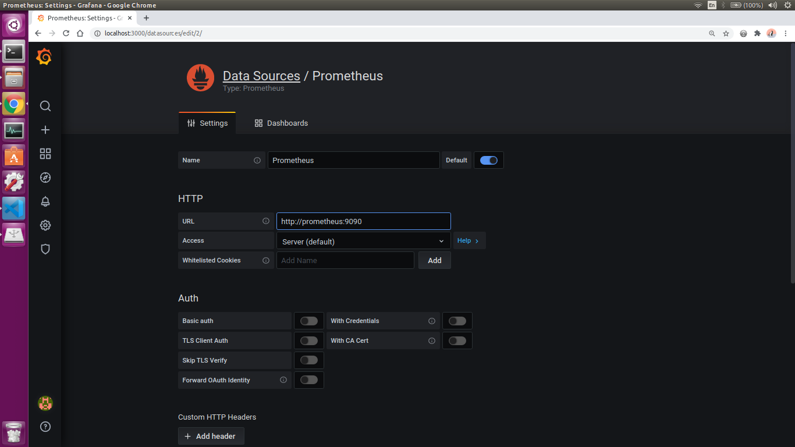
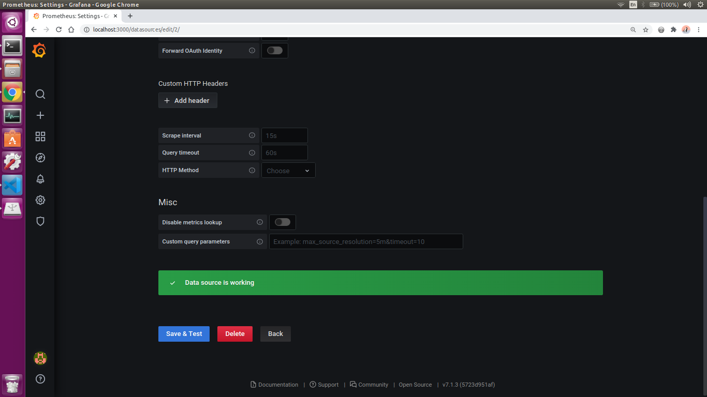
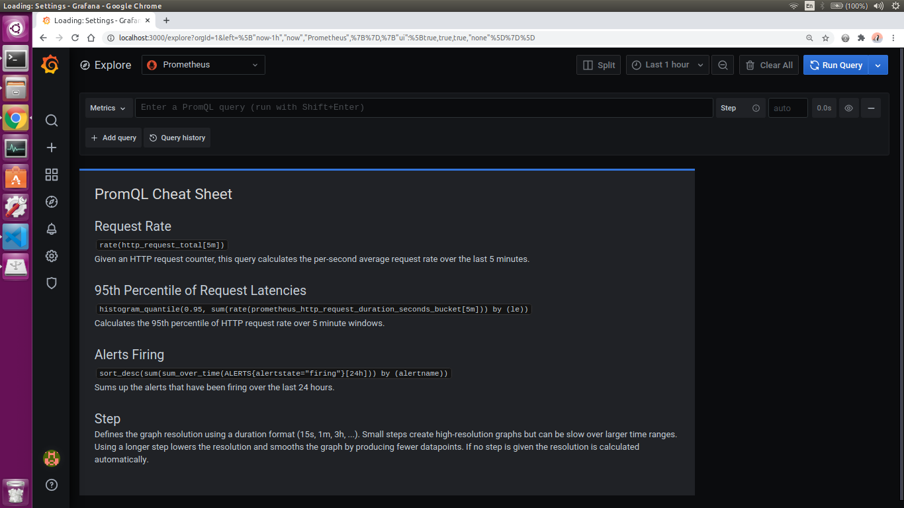
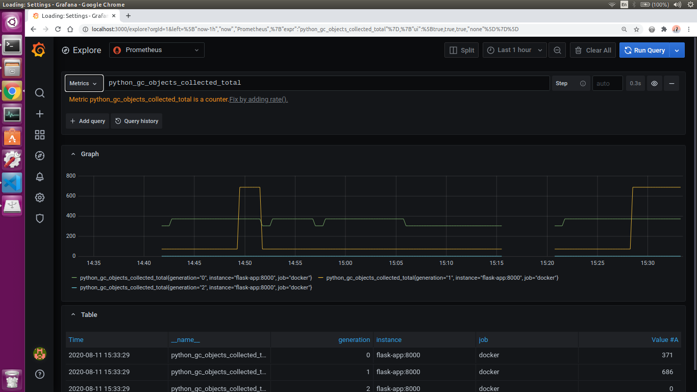

# Example of Prometheus with Grafana usage


## Build

```bash
docker-compose build
```


## Run

```bash
docker-compose up
```


## Working with services

### Flask application

View metrics:

```
http://localhost:8000/metrics
```


### Prometheus UI

```
http://localhost:9090
```


### Grafana

Enter UI: ```http://localhost:3000```

Loging: `admin`

Password: `password`


### Connenct to Prometheus



1. go to `Configuration` -> `Datasources`;

2. click `Add data source`;

3. select `Prometheus`;
4. add `URL` = `http://prometheus:9090`;

5. click `Save and test`.



### Go to dashboard

Go to `Explore`.



Select any metric.



